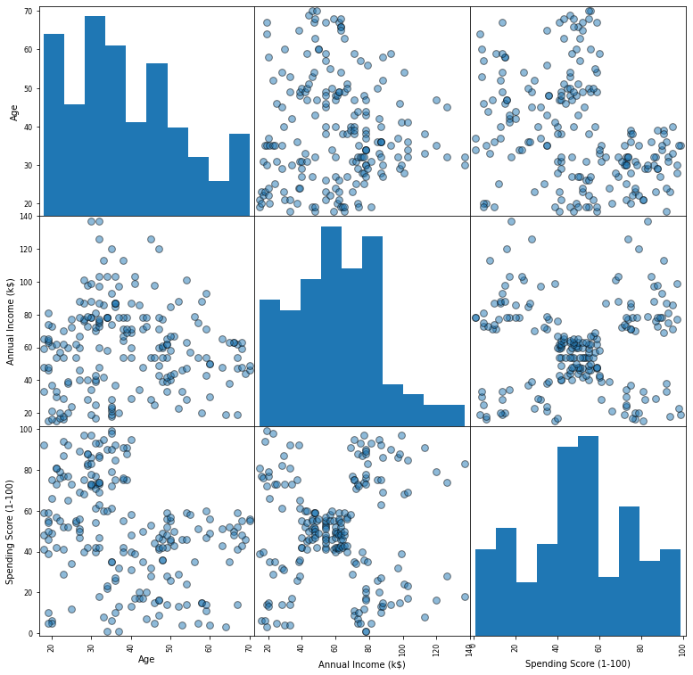

# Customers clustering
In this case i've tried to show the use of unsupervised learning in businesses for potential improving KPI's.
## Data
I've used the [Mall Customers dataset](https://github.com/Egor-Cherevan/Customers_clustering/blob/main/mall_customers.csv) as a train dataset. It consist of 5 features:
1.  CustomerID - It is the unique ID assigned to the customer
2.  Gender - Customers gender
3.  Age - Customers age(years)
4.  Annual Income(k$) - Customers annual income in k$
5.  Spending Score (1-100) - Customers score assigned by the mall based on the customer behavior
## Analysis
First of all I looked at the distribution of values. Here we can notice the apparent patterns between **Annual Income** and **Spending Score**. Thus we can assume with help of these values the data will be most clearly divided into groups. But I was also interested in making segmentation by **Age** and **Spending Score**.\

## Scaling
